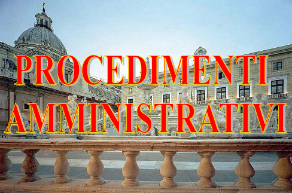

####################
Regolamento "Disciplina dei procedimenti amministrativi del Comune di Palermo"
####################

.. figure:: img/palermo.PNG

Fonte: `Regolamento comunale <https://www.comune.palermo.it/js/server/normative/_24122012094364.pdf>`_, Approvato con Deliberazione di Consiglio Comunale n. 608 del 27/10/2011.

`Procedimenti amministrativi - Legge Regionale 5 aprile 2011, n. 5 <https://www.comune.palermo.it/js/server/normative/_24122012094365.pdf>`_.

.. figure:: img/cc-by.png

Quest'opera è distribuita con `Licenza CC BY 4.0 <https://creativecommons.org/licenses/by/4.0/deed.it>`_ - Creative Commons,  Attribuzione, versione 4.0 Internazionale, in coerenza con la sezione `Licenze delle Linee Guida Nazionali per la Valorizzazione del Patrimonio Informativo Pubblico, dell'AgID <http://lg-patrimonio-pubblico.readthedocs.io/it/latest/licenzecosti.html?highlight=licenze#licenze>`_.

|

Testo del Regolamento 
==========================

.. toctree::

   _docs/capo1.rst
   _docs/capo2.rst
   _docs/capo3.rst
   _docs/capo4.rst
   _docs/capo5.rst
   _docs/capo6.rst
   _docs/capo7.rst
